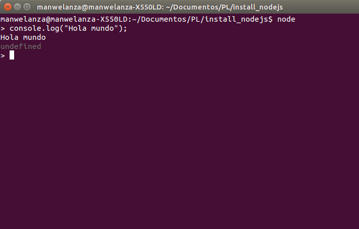
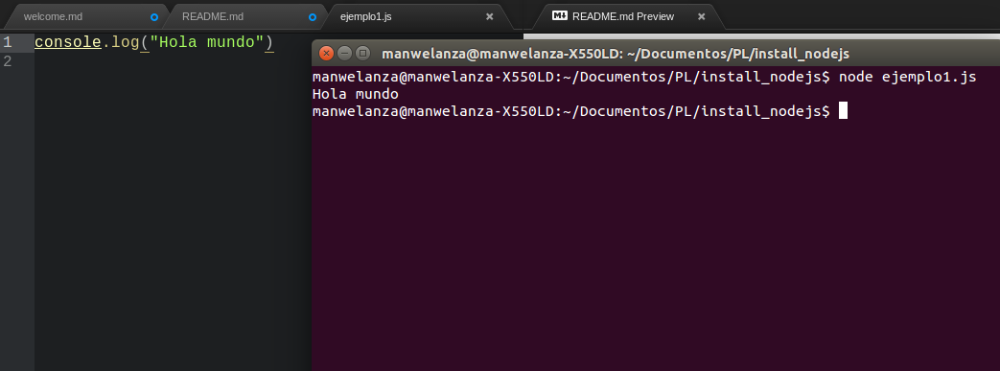
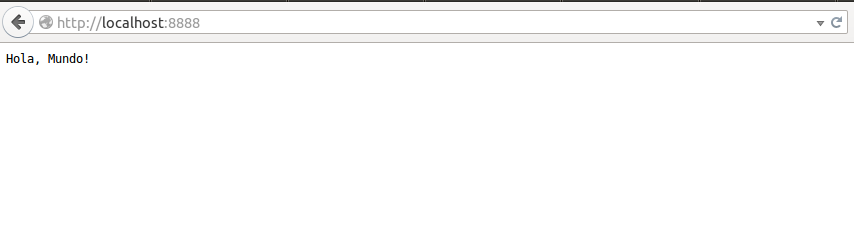

Practica 0
==========

##Instalación de nodejs en Ubuntu
Ponemos en consola los siguiente comandos por orden:

1. `sudo apt-get install curl`
2. `curl -sL https://deb.nodesource.com/setup | sudo bash`
3. `sudo apt-get install -y nodejs`

##Breve tutorial de uso de nodejs
Lo primero que debemos saber, es que tenemos dos formas de trabajar con nodejs:

* Como si fuera un intérprete, desde consola:

  

* Creando un fichero con extensión .js y llamándolo desde console con `node "nombre del fichero".js` :

  

##Ejemplo de un servidor muy simple con nodejs
Creamos un fichero .js y en el pondremos:

* `var http = require('http');` para importar el módulo http.
* `var server = http.createServer();` para declarar e inicializar la variable server, donde creamos el server con una función del módulo que hemos importado.
* ```
    function control(petic, resp) {
      resp.writeHead(200, {'content-type': 'text/plain'});
      resp.write('Hola, Mundo!');
      resp.end();
    }
    ```
    Aquí creamos la la función que se encargará de manejar y controlar las peticiones y respuestas hacia y desde el servidor. Primero mandamos la cabezera con una confirmación correcta (el 200) y con el tipo de contenido que vamos a mandar. Y luego mandamos el mensaje de "Hola mundo", algo muy sencillito, pero donde se vea que nuestro server trabaja correctamente.

* `server.on('request',control);` para que el server se encienda y realize la función control cuando reciba una petición.

* `server.listen(8888);` para asignarle un puerto que este escuchando.

    Ahora, con todo esto en un fichero, vamos a consola, lo abrimos con node y luego podremos ir a nuestro navegador y abrir el puerto que le hayais puesto y ver como funciona, en mi caso la dirección sería `localhost:8888`

    
